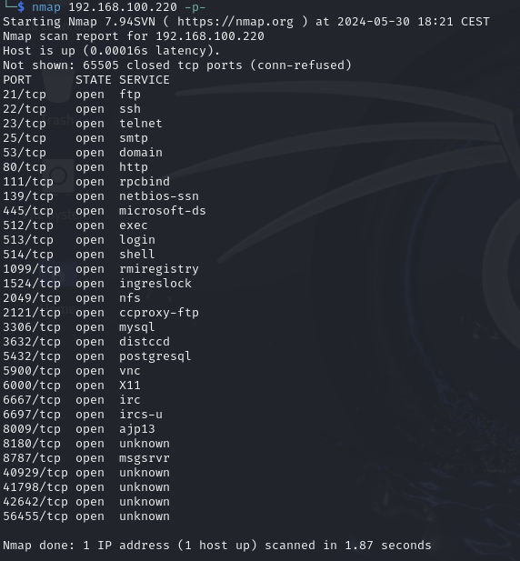
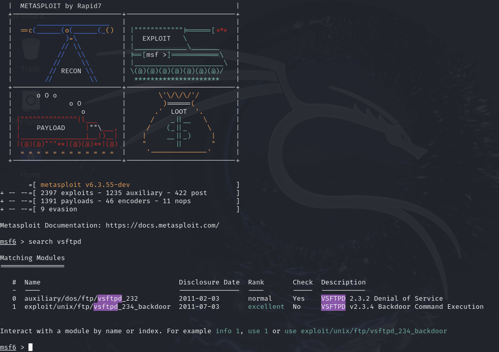
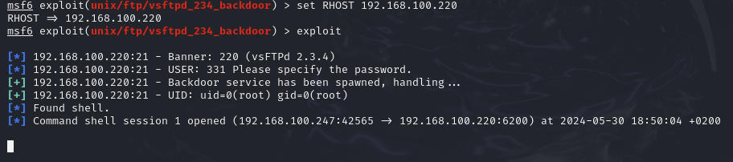
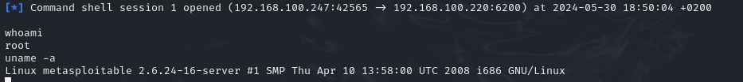
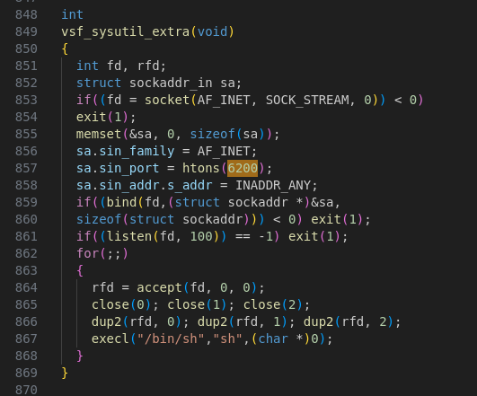
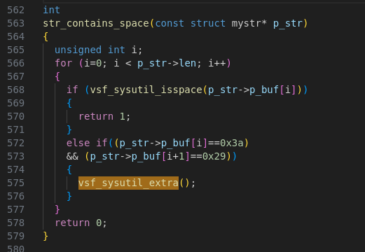
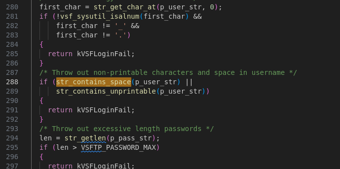

# Cybersecurity course demo

This report is concerning the [MSc Cybersecurity course (IN20 at University of Trieste)](https://bartoli.inginf.units.it/didattica/cybersecurity).

## Tools used
- [Metasploitable 2](https://www.youtube.com/watch?v=WBsCOjRQKnI)
- Kali Linux

## Port scanning

Having a look at available services, we can decide which one to exploit. I initially thought of exploiting Heartbleed vulnerability, but since there's not service on the port 443, we have to step into some other kind of attack.
Bumping across [this guide](https://blog.securelayer7.net/attacking-metasploitable-2-using-metasploit/), I then chose to exploit the Metasploitable VM using a VSFTPD v2.3.4 RCE backdoor.

## VSFTPD v2.3.4 RCE backdoor

The vsftpd 2.3.4 backdoor refers to a security vulnerability intentionally introduced into the vsftpd (Very Secure FTP Daemon) software in version 2.3.4. This backdoor was added by an unknown attacker who compromised the vsftpd distribution site, making it possible for attackers to gain unauthorized access to systems running this particular version of vsftpd.
This vulnerability is listed as a [CVE](https://nvd.nist.gov/vuln/detail/CVE-2011-2523).

Details of the vsftpd 2.3.4 Backdoor:

- **Backdoor Activation**: The backdoor is activated when a user logs in with a username containing a smiley face ":)".
- **Root Shell Access**: Once the backdoor is triggered, it opens a listening TCP port (usually port 6200) that provides a root shell to the attacker.
- **Exploit Consequences**: An attacker can then connect to this port and execute commands with root privileges, effectively taking control of the system.

A code found on [GitHub](https://github.com/ahervias77/vsftpd-2.3.4-exploit/blob/master/vsftpd_234_exploit.py) shows how easy it is to exploit the vulnerability. Once the login attempt is made, the socket on port 6200 can be opened and that will serve as a remote shell.

## Running the attack

First I have to start `msfconsole`, once it boots up, I can search for the `vsftpd` exploit.

There are two available exploits, but I'm going to use the second one, so I will type `use 1`.
I then have to specify the IP address of the machine with this command `set RHOST 192.168.100.220`.
At this point I can run the `exploit` command and then examine the results.

The attack was successful and I was able to access the shell. Now I can try to type in some commands to check the user and other things.

## Having a look at the backdoor code

Downloading [this repository](https://github.com/nikdubois/vsftpd-2.3.4-infected) can let us browse the infected code.
Searching for `6200` leads us to this function:

As we can notice, it's opening a socket on port 6200 and executing a shell for any string that it's passed on. `execl` will execute and leave a command.
Looking up where this function is getting called, we can notice:

`0x3a` and `0x29` are the hex codes for `:` and `)`.
This function, which is used here:

should have thrown a login error in case some special characters are in the username.
On [this YouTube video](https://www.youtube.com/watch?v=G7nIWUMvn0o) a user is demonstrating the vulnerability using NetCat. After the login process, the FTP server doesn't do anything, but the user is not thrown with a login error. The cause might be that this step of the login is not halting the whole parts, but just some of them.